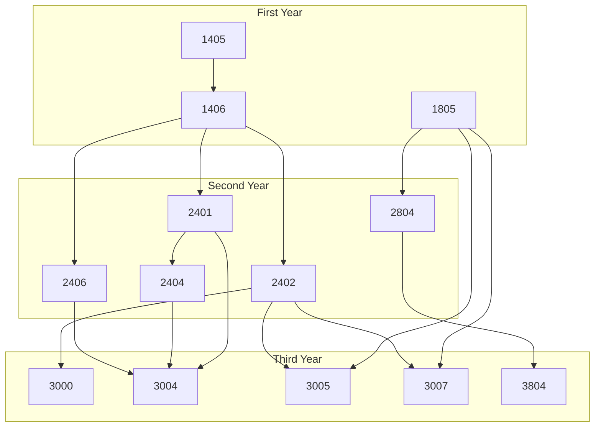
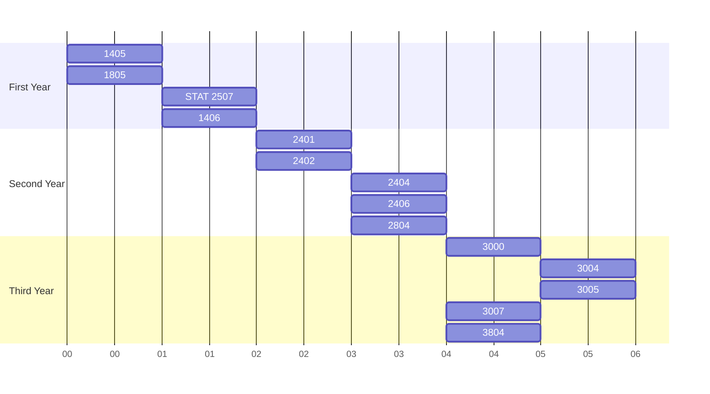

# Carleton Computer Science Course Tree

This repo breaks down some sample graphs of what the courses required for CS at
Carleton look like when it comes to requirements.

## Dependency Tree

This a visualization of the requirements tree for the different CS courses in
different years.

## Example Timeline

Although this graph isn't the only way to do it, here is an example timeline of
what your first few years might look like. The timeline from left to right is
one semester after another, excluding summer semesters. This doesn't take into
consideration any electives.

